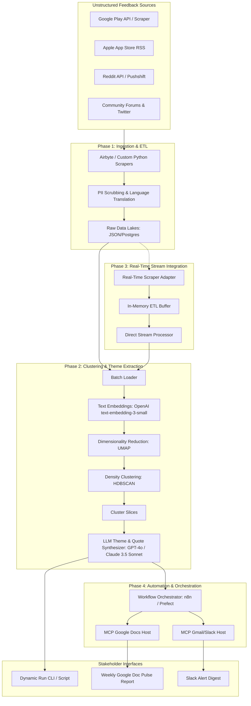

# AI-Powered Review Discovery Engine: Phase-Wise Architecture
**Target Product Focus:** Spotify (Growth Team initiative to increase music discovery & reduce familiarity bias)

---

## 1. Executive Summary & Design Philosophy
Spotify has a world-class recommendation engine (Home feed, Discover Weekly, Release Radar). However, user feedback indicates a growing "echo chamber" effect—users get locked into repetitive loops of familiar artists, repeat playlists, and previously liked songs.

To address this, we are designing **Echo-Echo**: an AI-Powered Review Discovery Engine. This engine automatically ingests, processes, clusters, and analyzes unstructured feedback from App Stores, Play Stores, Reddit, and online communities. It translates hundreds of thousands of user reviews into structured, actionable insights for the Product Management (PM) and Growth teams to design better discovery vectors.

---

## 2. High-Level System Architecture
The diagram below illustrates the ingestion, clustering, vector storage, RAG query, and automation workflow.



---

## 3. Phase-Wise Component Breakdown

### Phase 1: Data Ingestion & ETL Pipeline (Foundation)
This phase focuses on reliable, compliant, and structured data collection from various platforms.

*   **Ingestion Engines:**
    *   **App Store & Play Store:** Scrape using `google-play-scraper` and Apple iTunes RSS feeds.
    *   **Reddit & Forums:** Subreddit scrapers (`r/spotify`, `r/music`) targeting keywords like "recommendations", "stuck in loop", "same songs", "discover weekly bad".
    *   **Social & Forums:** Twitter/X API and Spotify Community RSS feeds.
*   **ETL & Cleanse:**
    *   **PII Scrubbing:** Regex and SpaCy-based Named Entity Recognition (NER) to filter out usernames, emails, phone numbers, and credentials.
    *   **Language Translation:** Integration with Google Translate API or LibreTranslate to convert multilingual reviews to English for unified vector indexing.
    *   **Metadata Enrichment:** Every review is tagged with metadata: *date, platform, rating, user segment (inferred from text where possible), and app version*.

---

### Phase 2: AI Reasoning & Clustering Engine
This phase moves beyond simple keyword matching (like "bug" or "bad") to semantic clustering using modern NLP.

```
Raw Review Text  -->  Embeddings Vector  -->  UMAP (2D/3D)  -->  HDBSCAN (Clustering)  -->  LLM Summarizer
```

*   **Vectorization:** Convert cleaned texts into 1536-dimensional vectors using `text-embedding-3-small`.
*   **Dimensionality Reduction (UMAP):** Scale down embeddings vectors to 5–10 dimensions to remove noise while preserving local and global structures.
*   **Density-Based Clustering (HDBSCAN):** Group reviews into dense semantic clusters. Unlike K-Means, HDBSCAN doesn't force noise points into clusters, which guarantees that only strong, coherent user pain points form a cluster.
*   **LLM Synthesis & Labeling:**
    *   Pass the top representative reviews of each cluster to GPT-4o / Claude 3.5.
    *   **Task 1:** Name the cluster (e.g., *"Discover Weekly Loop Fatigue"*). Max 6 words.
    *   **Task 2:** Pull verbatim quotes (checked using exact-substring verification to prevent hallucinations).
    *   **Task 3:** Suggest actionable product ideas (e.g., *"Introduce a 'Reset Recommendation' button"*). Max 25 words.

---

### Phase 3: Real-Time Stream Integration & On-the-Fly Processing
Bypasses persistent database storage in favor of immediate, on-demand analysis of live reviews as they are scraped.

*   **Real-Time Data Access:** Dynamically imports Phase 1 scraper modules and executes requests directly when triggered.
*   **In-Memory Stream Parsing:** Ingested JSON records are loaded directly in-memory, cleaned, translated, and passed directly into the embedder and clustering pipeline.
*   **Dynamic Custom Timeframe Filtering:** Support fetching specific time periods (e.g. "past 24 hours", "past week", or "past month") via scraper arguments, allowing targeted analysis.

---

### Phase 4: Automation, Orchestration & Delivery (MCP Integration)
Automates the system to run on a set schedule and distribute findings through standardized Model Context Protocol (MCP) integrations.

*   **Orchestrator (n8n / Zapier / Prefect):**
    *   Runs on a weekly cron (Monday 09:00 IST).
    *   Triggers the ingestion, triggers the clustering script, and collects the summary JSON.
*   **Google Docs MCP Server:**
    *   Authenticates with the Google Docs API using credentials stored safely in the MCP environment.
    *   Appends a new dated heading (e.g., `## Week of June 20, 2026`) and adds the cluster breakdown, representative quotes, and suggested actions.
*   **Gmail / Slack MCP Server:**
    *   Constructs a formatted summary email containing a deep link to the newly appended section in the master Google Doc.
    *   Sends notifications to relevant stakeholders.

---

### Phase 5: PM Decisioning Dashboard & Growth Loop
Translates insights into growth experiments.

*   **Temporal Trend Tracking:** Track cluster sizes week-over-week. If *"Recommendations Repeat Same Songs"* jumps from 3% to 15% of reviews, it triggers an immediate alert.
*   **Cohort Segmentation:** Filter issues by Premium vs. Free users, and iOS vs. Android users.
*   **Experimentation Feedback Loop:** Map proposed action items directly to A/B testing cards in Jira/Linear, enabling product managers to validate if changes to the discovery algorithms successfully reduce the cluster sizes.

---

## 4. Query Resolution Matrix
How the architecture specifically answers the core product discovery questions:

| Question from Problem Statement | Engineering Resolution Method |
| :--- | :--- |
| **Why do users struggle to discover new music?** | **HDBSCAN Clustering + LLM aspect extraction** will isolate clusters explaining the friction points (e.g., "algorithm is too conservative", "search is biased toward liked tracks"). |
| **What are the most common frustrations with recommendations?** | **Sentiment Tracking + Aspect Sentiment Analysis** will measure the volume and severity of negative reviews specifically linked to "Discover Weekly" or "Daily Mixes". |
| **What listening behaviors are users trying to achieve?** | **LLM Semantic Classification** categorizes user requests (e.g., "active seeking", "passive background listening", "mood-specific exploration"). |
| **What causes users to repeatedly listen to the same content?** | **Review classification** identifies themes like comfort listening, fear of bad recommendations, UI defaults prompting repeat plays, or lack of visual cues for new releases. |
| **Which user segments experience different discovery challenges?** | **Metadata Filtering (Premium vs Free, Region, Device)** segments clusters to find out if Free users struggle due to shuffle restrictions, or if Premium users struggle due to algorithmic echo-chambers. |
| **What unmet needs emerge consistently across reviews?** | **RAG Semantic Search** runs keyword/concept queries (e.g., "wish I could...", "why can't I...") to identify feature gaps. |

---

## 5. Security, Cost & Scale Guardrails

*   **Security (PII Protection):** Sanitization is executed *before* any text goes to the Vector DB or external LLM APIs.
*   **Cost Control:**
    *   Limit vectorization to reviews that contain descriptive text (e.g., length > 25 characters).
    *   Use hierarchical clustering—summarize sub-clusters before passing to the main LLM to reduce input tokens.
*   **Rate Limits:** Implement exponential backoff when querying App Store RSS and external APIs to avoid getting blocked.
