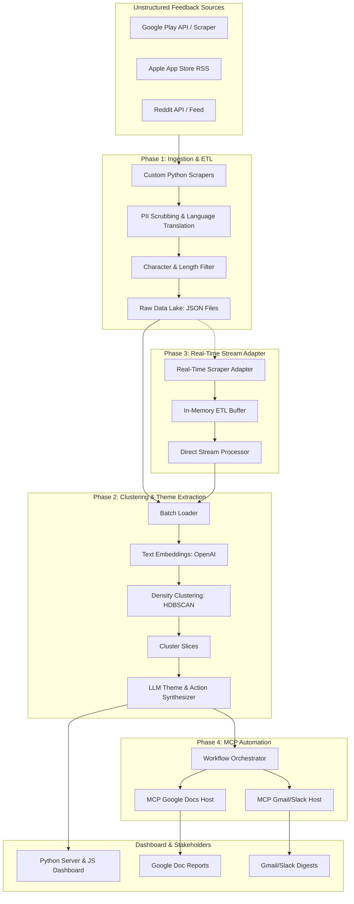

# Echo-Echo: AI-Powered Review Discovery Engine

**Echo-Echo** is an AI-powered review ingestion, processing, and semantic analysis engine designed for the **Spotify Growth Team**. It aims to surface user friction points regarding music discovery, repetitive loops, and recommendations to help engineers and product managers design better discovery vectors.

The project automatically gathers unstructured feedback from the Apple App Store, Google Play Store, and Reddit, filters and cleans it, clusters reviews using machine learning (embeddings + HDBSCAN), synthesizes themes using LLMs, and presents them in an interactive PM decision-making dashboard.

---

## 🛠️ Tech Stack

- **Backend & Pipeline Core:** Python 3.12
- **Data Gathering:** Apple iTunes RSS Feed, `google-play-scraper`, Reddit JSON Feeds & Mock API generator
- **Text Processing & Translation:** `deep-translator` (Google Translate engine), Regex PII Scrubbing
- **AI & Analytics:**
  - **Embeddings:** OpenAI `text-embedding-3-small` (1536 dimensions)
  - **Clustering:** HDBSCAN / Scikit-Learn
  - **LLM Reasoning & Labeling:** GPT-4o / Claude 3.5 Sonnet
- **Automation & Orchestration:** Model Context Protocol (MCP) clients (interacting with Google Docs, Slack, Gmail)
- **Web Dashboard:** Vanilla HTML5, Modern CSS (Glassmorphism & Sleek Dark Mode), Vanilla JavaScript, Python HTTP server (`http.server` backend)
- **Environment:** Windows PowerShell, Virtualenv

---

## 📐 System Workflow & Architecture



---

## 📂 Phase-Wise Component Breakdown

### Phase 1: Ingestion & ETL Pipeline (`/phase_1`)
Handles multi-region data gathering (US, IN, GB, CA, AU) and applies rigorous cleaning filters:
- **PII Scrubbing:** Removes emails, phone numbers, IP addresses, and social handles from reviews.
- **Language Translation:** Auto-translates foreign reviews to English using `deep-translator`.
- **Strict Verification Filters:**
  - **Length constraint:** Reviews must have a content length between 1 and 50 characters.
  - **Character constraint:** Strict regex whitelist (`^[a-zA-Z0-9\s.,!?'"()\-]*$`) which automatically filters out emojis and special characters to capture clean, brief user feedback.
  - **Reddit Mock Generator:** Fallback mock Reddit generator using compliant, short templates that bypass the filters to populate Reddit source metrics during API blocks.

### Phase 2: Analytics & Theme Clustering (`/phase_2`)
Leverages vector embeddings and unsupervised clustering to group semantically similar feedback:
- **Vectorization:** Converts cleaned reviews into dense embeddings using `text-embedding-3-small`.
- **Clustering:** Groups reviews using density-based HDBSCAN, sending outliers to an "Unclustered" bucket to preserve data integrity.
- **LLM Synthesis:** Synthesizes each cluster into a 6-word theme title, representative quotes, and a 25-word actionable PM idea.
- **Encoding Stability:** Dynamically reconfigures standard output streams to `utf-8` on Windows to prevent console printing failures from LLM-generated emojis.

### Phase 3: Real-Time Stream Integration (`/phase_3`)
Adapts the batch pipelines to support streaming inputs. Features on-the-fly cleaning, filtering, and yielding of live-scraped reviews to feed live monitoring systems without waiting for persistent disk writes.

### Phase 4: Automation & MCP Orchestration (`/phase_4`)
Uses a central script to run the pipelines end-to-end and leverage MCP (Model Context Protocol) servers to generate growth reports, publish Google Docs updates, or push notifications to Slack and Gmail channels.

### Phase 5: PM Decisioning Dashboard (`/phase_5`)
A premium, dark-themed HTML/JS dashboard that serves as the interface for Growth PMs:
- **Overview Stats:** Visual cards showing total processed reviews, source counts, and segment distribution.
- **Theme Explorer:** Highlights the generated clusters, action items, and verbatim user quotes.
- **Temporal Trends & Growth Loops:** Tracks emerging patterns and lets PMs design, document, and monitor A/B test experiments directly inside the app.

---

## 🚀 Execution & Setup Instructions

### 1. Environment Setup
All dependencies are isolated in the Python virtual environment located in `phase_3/venv/`. Activate it before running commands:

```powershell
# Windows PowerShell
.\phase_3\venv\Scripts\activate
```

### 2. Phase 1 Ingestion Pipeline
To ingest and clean reviews (defaulting to multi-region US, IN, GB, CA, AU):
```powershell
# Set limit (e.g., fetch ~1200 reviews)
.\phase_3\venv\Scripts\python phase_1\pipeline.py --limit 1200
```
This saves raw JSON files and cleaned/filtered JSON files in the `/Data` directory.

### 3. Phase 2 Clustering Pipeline
To cluster the latest cleaned dataset and synthesize themes with LLMs:
```powershell
.\phase_3\venv\Scripts\python phase_2\pipeline.py
```
This outputs a `cluster_results_TIMESTAMP.json` report in the `/Data` directory and prints the themes to the console.

### 4. Running the Dashboard
To start the local web server:
```powershell
.\phase_3\venv\Scripts\python phase_5/server.py
```
Open **[http://localhost:8000](http://localhost:8000)** in your browser. Use the dropdown in the top-right corner to select your latest ingestion/clustering run.

---

## 🔬 Running Verification Tests
To run verification scripts ensuring adapters and streams are functional:
```powershell
# Stream integration test
.\phase_3\venv\Scripts\python phase_3\test_stream.py

# Clustering validation test
.\phase_3\venv\Scripts\python phase_2\test_clustering.py
```
